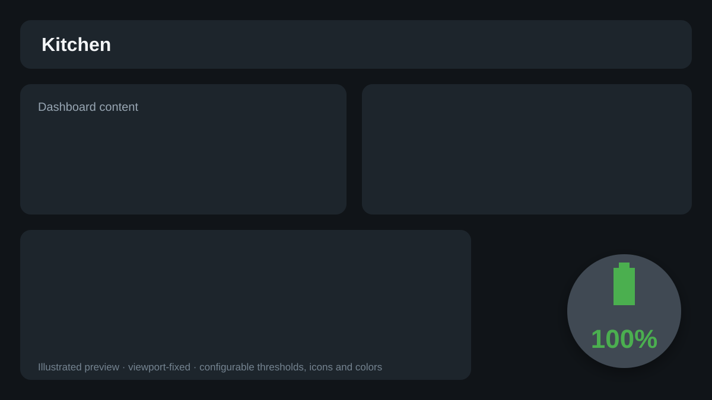

# Floating Battery Card

[](https://github.com/moryoav/lovelace-floating-battery-card/actions/workflows/ci.yml)
[](https://github.com/moryoav/lovelace-floating-battery-card/actions/workflows/hacs.yml)

A standalone Home Assistant Lovelace card that keeps a battery indicator fixed to a viewport corner, independent of dashboard columns and vertical scrolling.

It was designed for wall tablets, phones, laptops, UPS devices, vehicle batteries, and any other battery sensor you want visible while scrolling a dashboard.

## Preview



The image above is an illustrated preview of the default floating behavior and configurable battery states; the actual card renders directly from your Home Assistant entities and theme.

## Highlights

- True viewport overlay: the visual element is portaled to `document.body`, so `layout-card`, grids, masonry, overflow containers, and transformed ancestors do not capture it.
- Inline mode for normal card placement and dashboard-editor previews.
- Battery level + optional charging-state entity or attributes.
- Dynamic charging/full/unavailable icons and optional 10% battery icons.
- Unlimited configurable thresholds with independent icon/text/background/border/ring colors.
- Configurable position, shape, size, safe-area offsets, z-index, progress ring, animations, visibility rules, actions, and accessibility text.
- Graphical Lovelace editor.
- No `card-mod`, `button-card`, Mushroom, Browser Mod, or other Home Assistant custom-card dependency.

## Installation

### HACS custom repository

Until this repository is accepted into HACS defaults:

1. Open HACS.
2. Open the three-dot menu and choose **Custom repositories**.
3. Add `https://github.com/moryoav/lovelace-floating-battery-card`.
4. Select **Dashboard** as the category.
5. Install **Floating Battery Card** and refresh the browser.

### Manual

Download `floating-battery-card.js` from `dist/` (or a release asset), copy it to `/config/www/floating-battery-card.js`, then add `/local/floating-battery-card.js` as a JavaScript module resource.

## Minimal configuration

```yaml
type: custom:floating-battery-card
entity: sensor.kitchen_ipad_battery_level
state_entity: sensor.kitchen_ipad_battery_state
```

Defaults intentionally match the original wall-tablet use case:

- 72 × 72 px circle
- bottom-right, 16 px from each edge
- safe-area aware
- `Charging` → `mdi:battery-charging`
- `Not Charging` → `mdi:battery`
- `Full` → `mdi:battery`
- 0–20% → `var(--error-color, #f44336)`
- 21–50% → `var(--warning-color, #ff9800)`
- 51–100% → `var(--success-color, #4caf50)`
- tap → more-info

## Advanced example

```yaml
type: custom:floating-battery-card
entity: sensor.kitchen_ipad_battery_level
state_entity: sensor.kitchen_ipad_battery_state

state_map:
  charging: [Charging]
  not_charging: [Not Charging]
  full: [Full]

thresholds:
  - max: 15
    color: "#d32f2f"
    background_color: "rgba(211, 47, 47, 0.12)"
  - max: 40
    color: "#fb8c00"
  - max: 75
    color: "#fdd835"
  - max: 100
    color: "#43a047"

icons:
  default: mdi:battery
  charging: mdi:battery-charging
  full: mdi:battery
  unavailable: mdi:battery-unknown
  dynamic_level: true

position:
  mode: viewport
  anchor: bottom-right
  offset_x: 20
  offset_y: 20
  safe_area: true
  z_index: 1000

appearance:
  size: 76
  shape: circle
  padding: 7
  icon_size: 29
  text_size: 13
  font_weight: 600
  box_shadow: 0 3px 12px rgba(0, 0, 0, 0.4)

colors:
  background: var(--ha-card-background, var(--card-background-color))

ring:
  enabled: true
  width: 4
  color_mode: threshold
  track_color: rgba(127, 127, 127, 0.25)
  start_angle: -90
  clockwise: true

animation:
  charging: breathe
  low_battery: pulse
  low_battery_threshold: 15
  hover: lift
  duration: 1200
  respect_reduced_motion: true

behavior:
  unavailable: dim
  hide_when_full: false
  compact_below_width: 600
  compact_size: 60

tap_action:
  action: more-info
hold_action:
  action: navigate
  navigation_path: /config/devices/dashboard
double_tap_action:
  action: none
```

## Configuration reference

All sections are optional except `entity`.

### Sources and normalization

| Option | Default | Description |
|---|---:|---|
| `entity` | required | Battery-level entity. |
| `state_entity` | — | Optional charging-state entity. |
| `level_attribute` | — | Read level from an attribute instead of entity state. |
| `state_attribute` | — | Read charging state from an attribute. If `state_entity` is omitted, the attribute is read from `entity`. |
| `min_level` | `0` | Raw value corresponding to 0%. |
| `max_level` | `100` | Raw value corresponding to 100%. |
| `clamp_level` | `true` | Clamp normalized values to 0–100%. |
| `invert_level` | `false` | Invert the normalized level. |
| `precision` | `0` | Display decimals, 0–4. |
| `unit` | `%` | Display unit. |
| `full_threshold` | `100` | Derive `full` when no state source exists and level reaches this percentage. |

Numeric states may be numbers or strings such as `85`, `85%`, or `85 %`.

### `state_map`

| Option | Default |
|---|---|
| `case_sensitive` | `false` |
| `normalize_whitespace` | `true` |
| `charging` | `[Charging]` |
| `not_charging` | `[Not Charging, Discharging]` |
| `full` | `[Full]` |
| `unavailable` | `[Unknown, Unavailable, unknown, unavailable]` |

### `thresholds`

Thresholds are sorted by ascending `max`. The first matching range wins. Each entry supports:

- `min` (optional)
- `max` (required)
- `color` shorthand
- `icon_color`
- `text_color`
- `background_color`
- `border_color`
- `ring_color`
- `icon`
- `animation`

Color precedence is state override → threshold-specific property → threshold `color` → global color → theme default when `colors.state_overrides_threshold` is true. Set it false to place threshold colors ahead of state colors.

### `icons`

`default`, `charging`, `full`, `unavailable`, `dynamic_level`, `dynamic_charging_level`, `size`, and `rotation` are supported. Invalid icon strings fall back safely.

### `colors`

Global options: `icon`, `text`, `background`, `border`, `shadow`, `charging`, `full`, `unavailable`, `focus_ring`, `ring_track`, `ring`, and `state_overrides_threshold`.

CSS colors and Home Assistant theme variables are accepted.

### `display`

- `show_icon`, `show_level`, `show_unit`, `show_name`
- `name`
- `unknown_text`, `unavailable_text`
- `layout`: `stacked`, `horizontal`, `overlay`
- `gap`
- `tooltip`: `automatic`, `custom`, `disabled`
- `tooltip_text`
- `aria_label`

### `position`

- `mode`: `viewport` or `inline`
- `anchor`: `top-left`, `top-center`, `top-right`, `middle-left`, `center`, `middle-right`, `bottom-left`, `bottom-center`, `bottom-right`, `custom`
- `offset_x`, `offset_y`
- `top`, `right`, `bottom`, `left` for custom positioning
- `z_index`
- `safe_area`
- `edge_margin`

Numbers are interpreted as pixels. CSS lengths such as `1rem`, `2vh`, and `calc(...)` are also accepted for dimension fields.

### `appearance`

- `size`, `width`, `height`
- `shape`: `circle`, `rounded-square`, `square`
- `border_radius`, `padding`, `icon_size`, `text_size`, `name_size`
- `font_weight`, `line_height`
- `opacity`, `background_opacity`
- `border_width`, `border_style`
- `box_shadow`, `backdrop_blur`
- `hover_opacity`, `active_scale`, `transition_duration`

For `shape: circle`, width and height are deliberately forced equal even if only one dimension override is provided.

### `ring`

`enabled`, `width`, `inset`, `track_color`, `color`, `color_mode` (`fixed`/`threshold`), `start_angle`, `clockwise`, `rounded_caps`, and `level_mode` (`normalized`/`raw`).

### `animation`

- charging: `none`, `pulse`, `breathe`, `glow`, `rotate`
- low battery: `none`, `pulse`, `blink`
- hover: `none`, `scale`, `lift`
- `duration`, `timing_function`, `low_battery_threshold`, `transition_duration`
- `respect_reduced_motion`
- `disabled`

### `behavior`

- `unavailable`: `show`, `dim`, `hide`
- `hide_when_full`, `hide_when_charging`, `hide_when_not_charging`
- `min_viewport_width`, `max_viewport_width`
- `compact_below_width`, `compact_size`
- `pointer_events`
- `auto_hide_delay` (milliseconds; `0` disables)
- `restore_on_change`
- `more_info_entity`

### Actions

Standard Home Assistant action configuration is accepted for `tap_action`, `hold_action`, and `double_tap_action`. The default tap action is `more-info`.

## Why viewport mode survives scrolling

The Lovelace card host itself renders with `display: contents`, so it occupies no visible row. The rendered battery control is created as a separate custom element under `document.body` with `position: fixed`. Because it is no longer a descendant of `layout-card`, CSS Grid, masonry, or a transformed scrolling container, those ancestors cannot turn fixed positioning into container-relative positioning.

Each card instance owns exactly one overlay. The overlay is removed when the card disconnects, updated in place when configuration/state changes, and hidden when Home Assistant navigates away from the path where the card was created. Multiple card instances can coexist.

The card detects Lovelace editor-preview ancestry and switches that instance to inline rendering so it does not float over the editor UI.

## Development

Prerequisite: Node.js 24+.

```bash
npm install
npm run check
```

Useful commands:

```bash
npm run lint
npm run typecheck
npm test
npm run build
npm run format
```

The production bundle is `dist/floating-battery-card.js`.

## HACS / release policy

- The repository name begins with `lovelace-`, so HACS accepts the matching `dist/floating-battery-card.js` filename.
- `hacs.json` explicitly declares `floating-battery-card.js`.
- HACS validation runs on pushes, pull requests, scheduled checks, and manual dispatches.
- Tags matching `v*` run the release workflow and attach the built JavaScript file to the GitHub release.

## Troubleshooting

**The card does not appear after an upgrade:** hard-refresh the browser and clear the Home Assistant frontend cache if needed.

**The state icon never changes:** verify `state_entity` or `state_attribute` contains one of the configured `state_map` strings.

**The level is unavailable:** verify `entity` is numeric, or configure `level_attribute` if the number is stored in an attribute.

**The button appears behind another overlay:** increase `position.z_index`.

**I want it to behave like a normal Lovelace card:** set `position.mode: inline`.

## License

MIT
